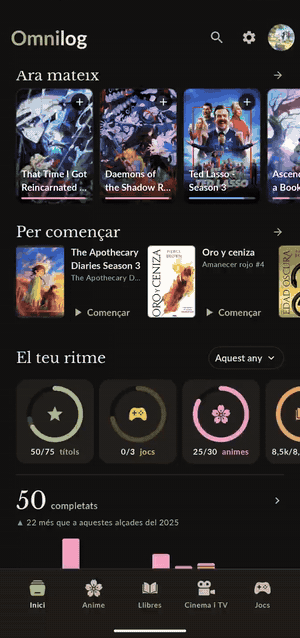
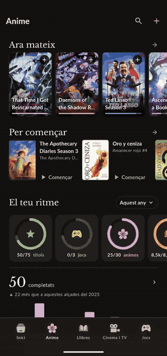
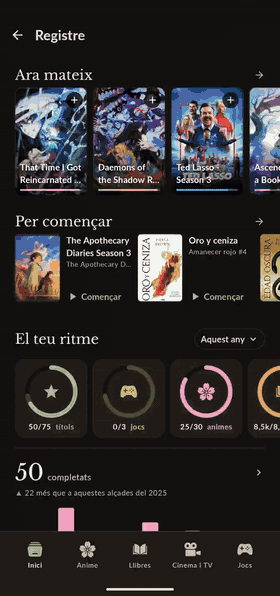
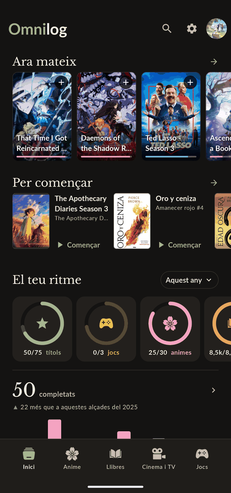
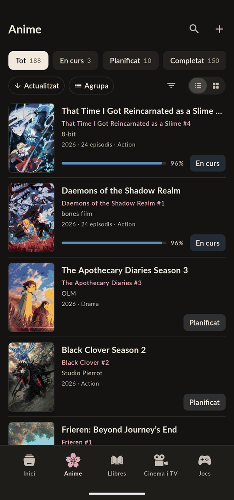
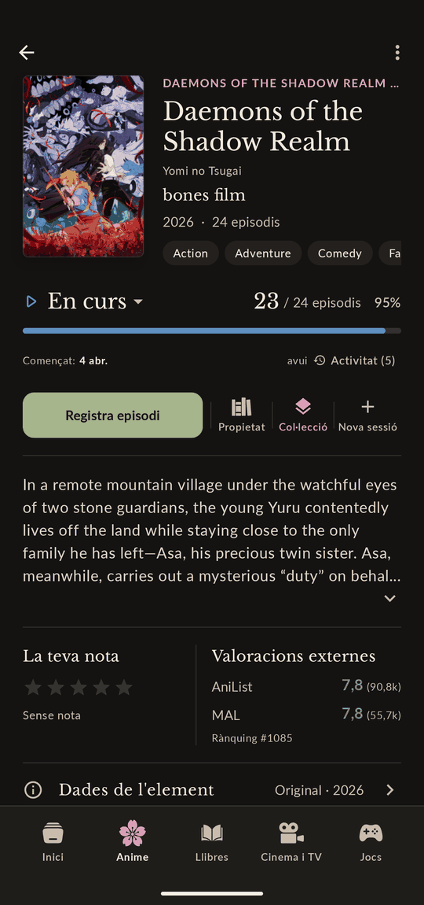
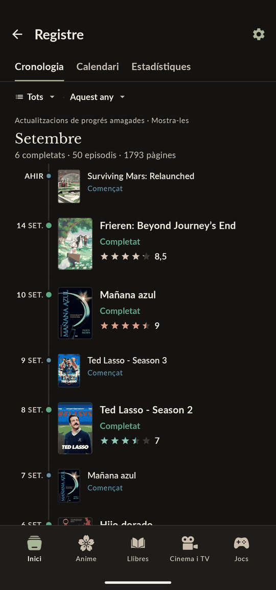
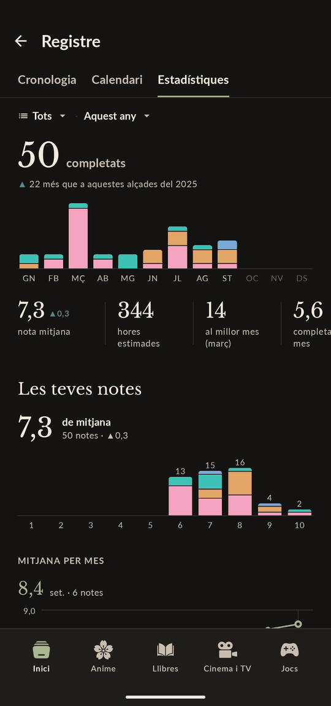
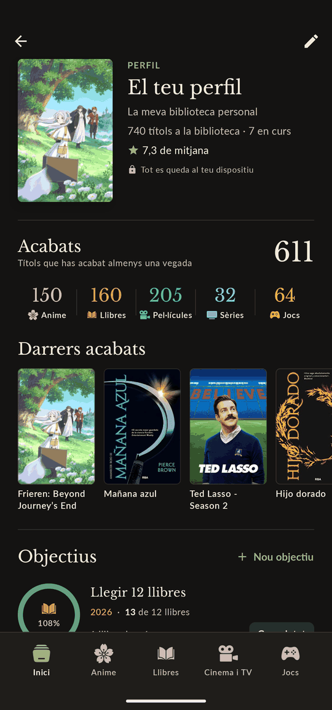

# Omnilog

[](https://github.com/Nilpomarol/Omnilog/actions/workflows/ci.yml)
[](LICENSE)

Omnilog is a native Android tracker for everything you watch, read and play: anime, books, movies and TV, and games, all in one place.

The app is **local-first**. The on-device database is the source of truth for your history and personal data. External providers such as AniList, TMDB, Open Library and Steam are used only to enrich items with metadata such as covers, synopses and ratings; they do not own or overwrite what you have logged.

The UI is currently in Catalan.

## Screenshots

<table>
  <tr>
    <td></td>
    <td></td>
    <td></td>
  </tr>
</table>

<table>
  <tr>
    <td></td>
    <td></td>
    <td></td>
  </tr>
  <tr>
    <td></td>
    <td></td>
    <td></td>
  </tr>
</table>

## Features

### Unified tracking

Anime, books, movies/TV and games share the same core model for:

- sessions and activity history;
- progress;
- personal ratings and notes;
- ownership;
- collections;
- start and completion history.

Progress can be logged in the unit that makes sense for each medium: episodes, pages, minutes or hours. Activity is preserved rather than flattened, so re-watches and re-reads retain their own history.

### Timeline, statistics and goals

- Library-wide timeline and calendar derived from activity history.
- Yearly comparisons and completion statistics.
- Rating distributions.
- Personal goals with pace tracking.

### Metadata enrichment

Omnilog can search, link and refresh metadata from:

- AniList
- MyAnimeList
- TMDB
- OMDb
- Open Library
- Google Books
- RAWG
- IGDB
- Steam

Metadata refreshes show a preview before applying changes and are designed not to overwrite local user data.

### Imports and sync

- MyAnimeList XML export or account import.
- IMDb CSV import.
- StoryGraph CSV import.
- Additive, duplicate-aware imports.
- Background enrichment jobs that can be paused, resumed, cancelled and recovered after interruption.
- MyAnimeList progress sync through an offline-tolerant queue.
- MAL-only titles are not deleted by sync.

### Backup and appearance

- Full backup and restore.
- Automatic backups.
- System, light and dark themes with separate palettes.

## Architecture and data integrity

Omnilog uses Room as the local persistence layer. The current schema is **version 37** and uses hand-written migrations. Schema versions are exported under [`app/schemas`](app/schemas), and recent migrations are covered by instrumented migration tests.

A central design rule is that metadata operations must never destroy personal history. Sessions, ratings, notes, ownership and collections are treated as protected user data. These invariants are documented in [`AGENTS.md`](AGENTS.md) and covered by tests such as [`HistoryInvariantTest`](app/src/test/java/com/nilpo/contenttracker/core/repository/HistoryInvariantTest.kt).

Application logic that does not depend on Android is kept separate where practical. Statistics, timeline calculations, objectives, import parsing and MyAnimeList sync payload generation can therefore be tested as plain JVM logic.

Test imports and fixtures under `app/src/test/resources` use synthetic data rather than real account exports.

## Tech stack

- **Language:** Kotlin
- **UI:** Jetpack Compose, Material 3
- **Persistence:** Room
- **Background work:** WorkManager
- **Navigation:** Navigation 3
- **Images:** Coil
- **Serialization:** kotlinx.serialization
- **Build:** Gradle with Kotlin DSL
- **Android:** min SDK 26, target/compile SDK 36

## Getting started

### Requirements

- JDK 21. Android Studio's bundled JBR works.
- Android SDK.

### Build

```bash
git clone https://github.com/Nilpomarol/Omnilog.git
cd Omnilog
cp gradle.properties.example gradle.properties
./gradlew :app:assembleDebug
```

On Windows:

```powershell
copy gradle.properties.example gradle.properties
.\gradlew.bat :app:assembleDebug
```

Android Studio normally writes the SDK path to `local.properties` automatically.

The debug build uses the application ID `com.nilpo.contenttracker.debug`, so it can be installed alongside a release-signed build.

## Provider configuration

Provider keys are optional. The app builds and runs without them, but search and enrichment capabilities are limited until the relevant providers are configured.

Keys can be set in the ignored root `gradle.properties`, in `~/.gradle/gradle.properties`, or as environment variables:

```text
TMDB_API_KEY
GOOGLE_BOOKS_API_KEY
RAWG_API_KEY
OMDB_API_KEY
IGDB_CLIENT_ID
IGDB_CLIENT_SECRET
MAL_CLIENT_ID
```

Keys are compiled into `BuildConfig`, so anyone who can install the APK can extract them. Use restricted or low-value keys, and do not distribute a build containing the IGDB client secret.

For MyAnimeList account sync, register the following OAuth redirect URI:

```text
omnilog://mal-oauth
```

## Testing

Run the JVM unit tests with:

```bash
./gradlew :app:testDebugUnitTest
```

On Windows:

```powershell
.\gradlew.bat :app:testDebugUnitTest
```

Migration and other Android instrumentation tests require an emulator or connected device.

CI is configured through GitHub Actions and is exposed by the badge at the top of this README.

## Project layout

```text
app/src/main/java/com/nilpo/contenttracker/
  core/   database, repository, imports, mal, stats, timeline, objectives, backup, refresh
  ui/     home, detail, add, timeline, stats, profile, settings, imports, theme
```

## Documentation

The repository contains more detailed product and implementation documentation under [`docs/`](docs/README.md).

Useful entry points:

- [Roadmap](docs/current/roadmap.md)
- [Design direction](docs/current/design.md)
- [Development guide](docs/current/development-guide.md)
- [Feature specifications](docs/features/)

## Data providers

Metadata, ratings and cover art come from AniList, MyAnimeList, TMDB, OMDb, Open Library, Google Books, RAWG, IGDB and Steam and belong to their respective owners.

This product uses the TMDB API but is not endorsed or certified by TMDB.

## License

[MIT](LICENSE)
